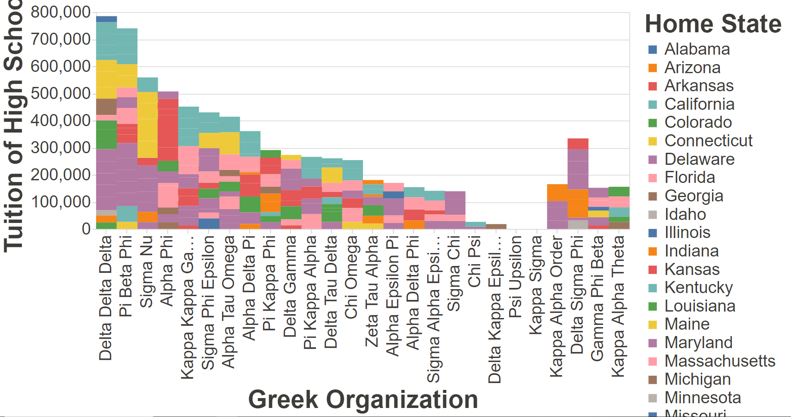
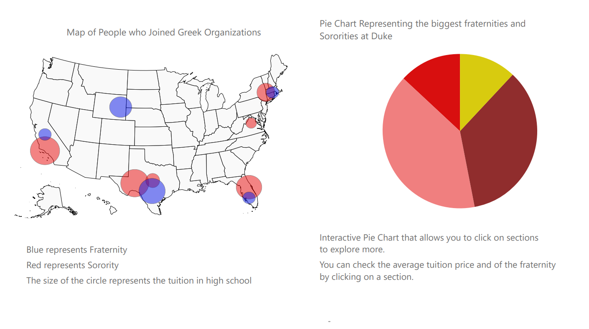

# Data Visualization Project

## Data

The data I propose to visualize for my project is the Duke University Greek Life Data Set. The dataset was originally published at [Greek-Life-Demographics](https://raw.githubusercontent.com/Chrissymbeck/Greek-Life-Demographics/master/Greek_Data_Duke_Class_of_2018.csv), this dataset contains the data The Chronicle used to analyze trends between those who do and don't join Greek life at Duke.

## Prototypes

I’ve created a proof of concept visualization of this data. It's a bar chart and it shows the average price of high school tuition of the people who joined Greek Life at Duke by the different states they come from. 

## Questions & Tasks

Tasks and Questions taht drive the visualization and interaction decisions for this project:

 * Create a United States HeatMap of students that come from different states to Duke and once you click on a circle it opens a new page to show a bar chart of the different fraternities or Sororities.
 * Creating bar chart from a drop menu of different states for the average tuition price by high school of Fraternities and Sororities.
 * Creating a pie chart based on the different factors available in the dataset about if the student went to a religious high school, if they recieved a merit scholarship, if they went to a Co-Ed High School, if they are in a Sports Team, How many international students joined Greek Life and how many did not ? 

## Sketches

## Open Questions

I will build a complete react website to hold all of these visualizations. I have not fully read about react-router-dom and creating these interconnecting links can be a bit tricky without that. 
