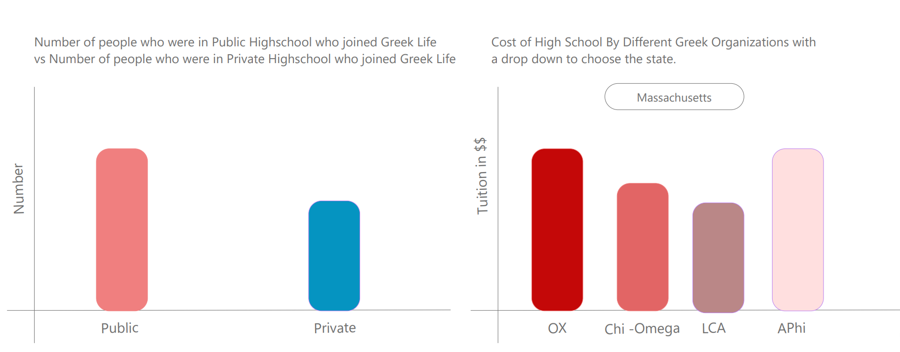

# Data Visualization Project

## Data

The data I propose to visualize for my project is the Duke University Greek Life Data Set. The dataset was originally published at [Greek-Life-Demographics](https://raw.githubusercontent.com/Chrissymbeck/Greek-Life-Demographics/master/Greek_Data_Duke_Class_of_2018.csv), this dataset contains the data The Chronicle used to analyze trends between those who do and don't join Greek life at Duke.

## Prototypes

I’ve created a proof of concept visualization of this data. It's a bar chart and it shows the average price of high school tuition of the people who joined Greek Life at Duke by the different states they come from. 

## Questions & Tasks

Tasks and Questions taht drive the visualization and interaction decisions for this project:

 * Create a United States HeatMap of students that come from different states to Duke and once you click on a circle it opens a new page to show a bar chart of the different fraternities or Sororities.
 * Create a pie chart that lets you click on a section and allows you to see the average price of tuition of the fraternity by each slice.
 * Creating bar chart from a drop menu of different states for the average tuition price by high school of Fraternities and Sororities.
 * Creating a pie chart based on the different factors available in the dataset about if the student went to a religious high school, if they recieved a merit scholarship, if they went to a Co-Ed High School, if they are in a Sports Team, How many international students joined Greek Life and how many did not ? 

## Sketches

The following image is a rough sketch of the United States Heat map of students that come from different states to Duke and once you click on a circle it opens a new page to show a bar chart of the different fraternities or Sororities. The pie chart right next to it lets you click on a section and allows you to see the average price of tuition of the fraternity by each slice.

The following image shows one of the different factors about the dataset that allows you to see if the students went to a public or a private high school. The dropdown next to it lets you create a bar chart based on different states for the average tuition price by high school of Fraternities and Sororities.

## Open Questions

I will build a complete react website to hold all of these visualizations. I have not fully read about react-router-dom and creating these interconnecting links can be a bit tricky without that. 

## Schedule of Deliverables 

[Project Timeline][Project Timeline]
|Phase        | Activities          |  Completion |
|-------------|---------------|-------------|
| Kickoff | Charming remarkable Muji wardrobe first-class international Gaggenau St Moritz signature joy efficient. | 1 May, 2015 |
| Research | Helsinki Sunspel Ettinger punctual cutting-edge Singapore destination St Moritz impeccable premium tote bag eclectic. | 15 May, 2015 |
| Wireframing | Destination Shinkansen K-pop global finest. Espresso Tsutaya boulevard flat white sharp Winkreative Boeing 787 Comme des Garçons elegant vibrant handsome Swiss Shinkansen boutique Fast Lane. | 29 May, 2015 |
| Style Guide | Ginza efficient alluring, cutting-edge Sunspel bespoke Helsinki carefully curated. | 12 June, 2015 |
| Prototyping | Business class ANA Helsinki cosy punctual, conversation charming signature. | 26 June, 2015 |
| Finalization | St Moritz sleepy the highest quality discerning Asia-Pacific iconic Singapore lovely Fast Lane the best perfect espresso Gaggenau. | 10 July, 2015 |
| CMS Implementation | Joy pintxos perfect Toto Singapore smart boutique Shinkansen punctual Ettinger ryokan essential Nordic.  | 24 July, 2015 |
| Testing & Training | Ettinger extraordinary boulevard, hand-crafted Gaggenau concierge discerning remarkable Porter first-class Muji Scandinavian essential. | 7 August, 2015 |
| Launch | Izakaya Comme des Garçons exclusive, Asia-Pacific Singapore boulevard joy liveable. | 21 August, 2015 |
